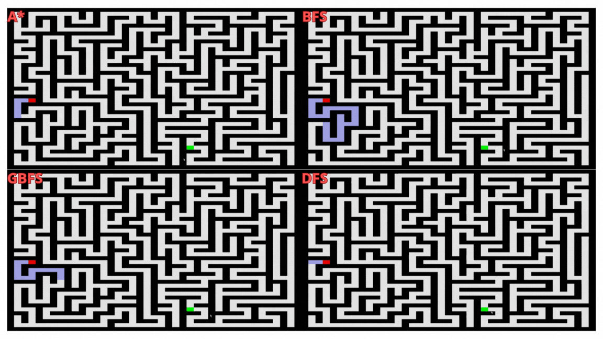

# Maze Generator and Solver

A Python-based maze generation and solving application that uses various search algorithms to find paths through procedurally generated mazes. The application features a visual interface using Pygame to display maze generation and solving processes.



## Features

- **Maze Generation**: Automatically generates random mazes using depth-first search algorithm
- **Multiple Solving Algorithms**:
  - **DFS (Depth-First Search)**: Uses a stack-based approach
  - **BFS (Breadth-First Search)**: Uses a queue-based approach
  - **GBFS (Greedy Best-First Search)**: Uses Manhattan distance heuristic
  - **A\* (A-Star)**: Optimal pathfinding with cost and heuristic
- **Visual Representation**: Real-time visualization of maze generation and solving using Pygame
- **Customizable Maze Size**: User can specify maze dimensions

## Project Structure

```
maze-gen-solve/
├── main.py                      # Entry point of the application
├── maze.py                      # Maze class for representation and visualization
├── mazegenerate.py              # Maze generation logic
├── mazesolve.py                 # Solving algorithms implementation
├── graph.py                     # Graph data structure
├── frontier.py                  # Base frontier class
├── stackfrontier.py             # Stack-based frontier (DFS)
├── queuefrontier.py             # Queue-based frontier (BFS)
├── priorityqueuefrontier.py    # Priority queue frontier (GBFS, A*)
└── maze.txt                     # Sample maze file
```

## Requirements

- Python 3.x
- Pygame

## Setup

1. **Clone the repository**:
   ```bash
   git clone https://github.com/Iongshiba/maze-gen-solve.git
   cd maze-gen-solve
   ```

2. **Install dependencies**:
   ```bash
   pip install pygame
   ```

## How to Run

1. **Run the main program**:
   ```bash
   python main.py
   ```

2. **Follow the prompts**:
   - Enter maze dimensions (e.g., `10 10` for a 10x10 maze)
   - A random maze will be generated and displayed
   - Choose a solving algorithm:
     - `DFS` - Depth-First Search
     - `BFS` - Breadth-First Search
     - `GBFS` - Greedy Best-First Search
     - `A*` - A-Star algorithm
   - Type `reset` to generate a new maze with different dimensions

3. **View the visualization**:
   - The Pygame window will display:
     - **Red (A)**: Start position
     - **Green (B)**: End position
     - **Black (#)**: Walls
     - **Light Blue (o)**: Explored cells
     - **White ( )**: Open paths

## Algorithm Comparison

| Algorithm | Strategy | Optimality | Performance |
|-----------|----------|------------|-------------|
| **DFS** | Stack (LIFO) | Not guaranteed | Fast but may not find shortest path |
| **BFS** | Queue (FIFO) | Optimal for unweighted graphs | Slower but finds shortest path |
| **GBFS** | Priority queue (heuristic) | Not guaranteed | Fast with good heuristic |
| **A*** | Priority queue (cost + heuristic) | Optimal | Best balance of speed and optimality |

## Example Usage

```
Enter the size (ex: 10 10): 15 15
# Maze is generated and displayed
Choose an algorithm (DFS, BFS, A*, GBFS): A*
# Solution is visualized in Pygame window
Choose an algorithm (DFS, BFS, A*, GBFS): reset
Enter the size (ex: 10 10): 20 20
```

## How It Works

1. **Maze Generation**: Uses a randomized depth-first search algorithm to create a perfect maze (every cell is reachable from every other cell with exactly one path)

2. **Maze Solving**: Converts the maze into a graph structure where each cell is a vertex and adjacent open cells are connected by edges

3. **Visualization**: Pygame renders the maze and animates the solving process, showing explored cells and the final path

## License

This project is open source and available for educational purposes.

## Author

Created by [Iongshiba](https://github.com/Iongshiba)

